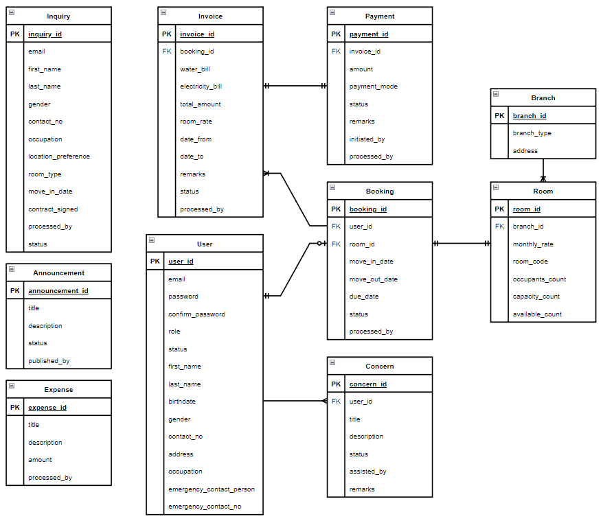

# Apartment Management System

A full stack Ruby on Rails web application to be used in managing real property rental businesses. 

## About the Project

### ERD

### Built With
- [Ruby on Rails](https://rubyonrails.org/)
- [TailwindCSS](https://tailwindcss.com/)

## Roadmap

- [x] Tenant Portal
- [x] Staff Portal
- [x] Add Paymongo API for Payments
- [x] Generate PDF for Invoices
- [ ] Notifications
- [ ] Landing Page with Google Map API

For more details about this project's progress, you can visit this [project's feature](https://github.com/users/jpatrickldg/projects/2).
